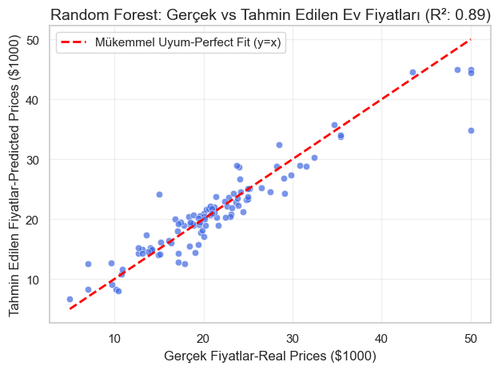
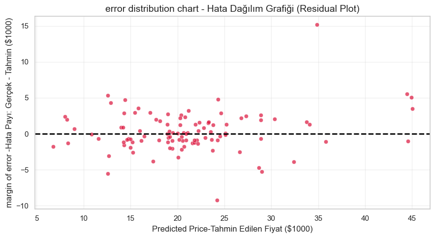

# 🏡 Boston Housing: End-to-End Regression & Residuals (R²: 0.89)

Bu proje, klasik Boston Housing veri seti üzerinde veri ön işleme, özellik mühendisliği (Feature Engineering), model kıyaslama ve artık (residual) analizini kapsayan uçtan uca bir makine öğrenmesi regresyon çalışmasıdır.

🔗 **Kaggle Notebook:** [Boston Housing Notebook](https://www.kaggle.com/code/burakaktakka/boston-housing-end-to-end-regression-residuals)

---

## 🚀 Proje Özeti ve Metodoloji

1. **Keşifçi Veri Analizi (EDA) & Ön İşleme:**
   - Hedef değişkendeki (`MEDV`) sağa çarpıklık (skewness) tespit edilerek `log1p` dönüşümü uygulandı.
   - Sayısal değişkenler `StandardScaler` ile ölçeklendirildi.
2. **Özellik Mühendisliği (Feature Engineering):**
   - Ev yaşı ile alt sosyoekonomik durum etkileşimi (`AGE * LSTAT`) ve sanayi yoğunluğu ile hava kirliliği etkileşimi (`INDUS * NOX`) gibi yeni değişkenler üretilerek model performansı artırıldı.
3. **Model Karşılaştırması:**
   - **Linear Regression:** $R^2 \approx 0.66$ (Baseline)
   - **Ridge Regression:** $R^2 \approx 0.72$ (Düzenlileştirme etkisi)
   - **Random Forest Regressor (Tuned):** $R^2 \approx 0.89$
4. **Hata ve Artık (Residual) Analizi:**
   - Hataların homoskedastik (sabit varyanslı) ve sıfır etrafında rastgele dağıldığı doğrulandı.
   - En büyük sapmaların veri setindeki 50.000$ tavan sınırına (censored data) takılan konutlardan kaynaklandığı tespit edildi.
  ### 📊 Model Performansı ve Değerlendirme

#### Gerçek vs. Tahmin Edilen Değerler (Actual vs. Predicted)

#### Artık Hata Analizi (Residual Plot)

---

## 🛠 Kullanılan Teknolojiler
- **Python**, **Pandas**, **NumPy**
- **Scikit-learn** (RandomForestRegressor, Ridge, StandardScaler, GridSearchCV)
- **Seaborn**, **Matplotlib**
- **Joblib** (Model kalıcılığı)
